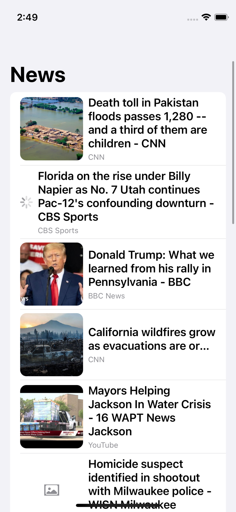
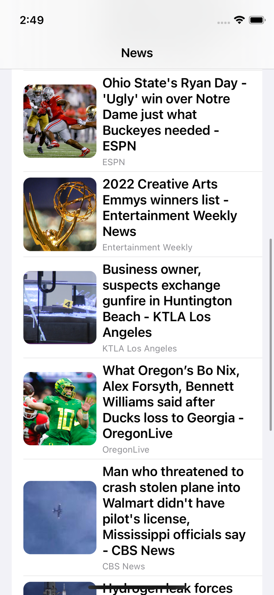
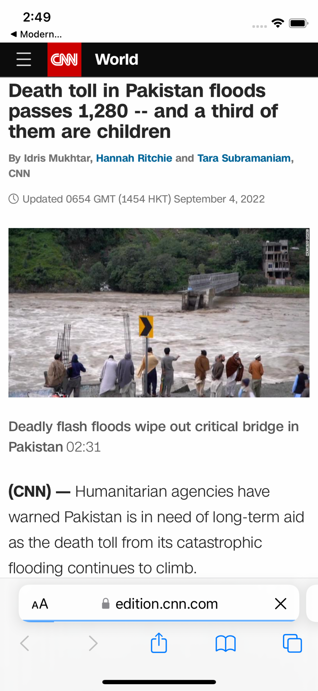

# ModernNewsApp  

Purpose of the project
======================

This is the demo app which has a list of news. My purpose is to learn Combine, SwiftUI, MVVM

This project has only one dependency which is [URL-Image](https://github.com/dmytro-anokhin/url-image) that implemented using Swift Package Manager.

#### Powered by [Lil News API](https://api.lil.software/news) :star: 

Here are the screens
======================

  &nbsp; 
    &nbsp; 
      &nbsp; 
    

## Tech-stack :calling:

* [MVVM](https://www.raywenderlich.com/34-design-patterns-by-tutorials-mvvm)
* [Combine]
* [SwiftUI]
* [URL-Image](https://github.com/dmytro-anokhin/url-image)

Find this repo useful?
======================

Find this repo useful? :heart: 

Support it by joining [stargazers](https://github.com/emrdgrmnci/ModernNewsApp/stargazers) for this repository. :star:
